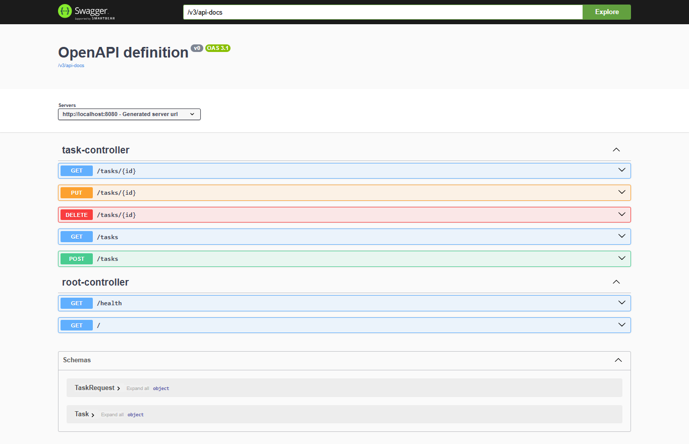

# Task API — BE-01

CRUD API for a to-do list. Java 25 + Spring Boot 4 + Lombok, in-memory storage.

## Run
mvn spring-boot:run
Server: http://localhost:8080
Swagger UI: http://localhost:8080/docs

## Endpoints
| Method | Path | Description |
|---|---|---|
| GET | / | API info |
| GET | /health | Health check |
| GET | /tasks | List all tasks |
| GET | /tasks/{id} | Get one task |
| POST | /tasks | Create task |
| PUT | /tasks/{id} | Update task |
| DELETE | /tasks/{id} | Delete task |

## Mortality experiment
In-memory storage. Restart wipes tasks back to 3 seed items — no database yet.

## Postman test cases

### Root & Health
| # | Method | URL | Body | Expected |
|---|---|---|---|---|
| 1 | GET | `/` | — | 200, API info JSON |
| 2 | GET | `/health` | — | 200, `{"status":"ok"}` |

### Read
| # | Method | URL | Body | Expected |
|---|---|---|---|---|
| 3 | GET | `/tasks` | — | 200, list of 3 seed tasks |
| 4 | GET | `/tasks/1` | — | 200, single task |
| 5 | GET | `/tasks/99` | — | 404, `{"error":"Task 99 not found"}` |

### Create
| # | Method | URL | Body | Expected |
|---|---|---|---|---|
| 6 | POST | `/tasks` | `{"title":"Buy milk"}` | 201, new task with `id`, `done:false` |
| 7 | POST | `/tasks` | `{}` | 400, `{"error":"title must not be empty"}` |

### Update
| # | Method | URL | Body | Expected |
|---|---|---|---|---|
| 8 | PUT | `/tasks/1` | `{"title":"Updated title","done":true}` | 200, updated task |
| 9 | PUT | `/tasks/99` | `{"title":"Whatever"}` | 404 |
| 10 | PUT | `/tasks/1` | `{}` | 400 |

### Delete
| # | Method | URL | Body | Expected |
|---|---|---|---|---|
| 11 | DELETE | `/tasks/1` | — | 204, empty body |
| 12 | DELETE | `/tasks/1` (again) | — | 404 |
| 13 | DELETE | `/tasks/99` | — | 404 |

### Full CRUD cycle (one flow)
1. POST `/tasks` `{"title":"Test task"}` → 201, note returned `id`
2. GET `/tasks/{id}` → 200, confirm it exists
3. PUT `/tasks/{id}` `{"title":"Test updated","done":true}` → 200
4. GET `/tasks/{id}` → 200, confirm change stuck
5. DELETE `/tasks/{id}` → 204
6. GET `/tasks/{id}` → 404, confirm gone

All 13 cases + full cycle re-run via Swagger UI "Try it out" at `/docs` — same results confirmed there too.

## Mortality experiment
In-memory storage. Restarting the server wipes all tasks back to the 3 seed items — no database yet, so nothing persists across restarts.

## Swagger screenshot
