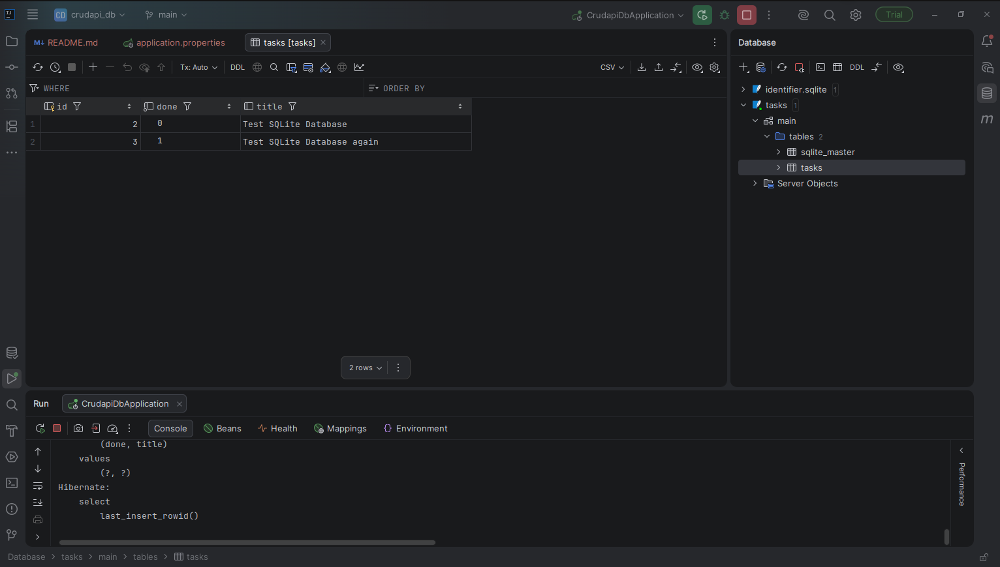

# 🚀 FlyRank Backend AI Engineering – Week 3 (BE-02)

<div align="center">

# Connecting Your CRUD to the Database

Replace an in-memory CRUD implementation with a persistent SQLite database using Spring Boot and Spring Data JPA.


</div>

---

# 📖 Overview

This project was developed as part of the **FlyRank Backend AI Engineering Internship – Week 3 (BE-02)** assignment.

The objective of this assignment is to replace the previous **in-memory task storage** with a real **SQLite database**, while keeping the REST API exactly the same.

The biggest takeaway from this assignment is understanding the separation between the **API layer** and the **Data layer**.

Before:

```text
Client
   │
   ▼
 REST API
   │
   ▼
In-Memory Array
```

After:

```text
Client
   │
   ▼
 REST API
   │
   ▼
SQLite Database
```

The client never notices the difference.

---

# 🎯 Assignment Goal

- Replace the in-memory task list with SQLite.
- Keep all CRUD endpoints unchanged.
- Store data permanently.
- Automatically create the database if it doesn't exist.
- Automatically create the table if missing.
- Seed the database with 3 sample tasks only once.
- Use SQL through Spring Data JPA.
- Demonstrate persistence after server restart.

---

# ✨ Features

- ✅ RESTful CRUD API
- ✅ SQLite Database
- ✅ Spring Boot 3
- ✅ Spring Data JPA
- ✅ Automatic Database Creation
- ✅ Automatic Table Creation
- ✅ Automatic Seed Data
- ✅ Persistent Storage
- ✅ Layered Architecture
- ✅ Repository Pattern
- ✅ Global Exception Handling
- ✅ Request Validation
- ✅ Integration Testing (JUnit + MockMvc)

---

# 🛠️ Technology Stack

| Technology | Version |
|------------|---------|
| Java | 17 |
| Spring Boot | 3.x |
| Spring Data JPA | Latest |
| SQLite | Latest |
| Maven | Latest |
| Lombok | Latest |
| JUnit 5 | Latest |
| MockMvc | Latest |

---

# 📂 Project Structure

```text
src
 ├── controller
 │     └── TaskController
 │
 ├── service
 │     └── TaskService
 │
 ├── repository
 │     ├── TaskRepository
 │     ├── JpaTaskRepository
 │     └── SqliteTaskRepository
 │
 ├── model
 │     └── Task
 │
 ├── dto
 │     ├── TaskRequest
 │     └── ErrorResponse
 │
 ├── exception
 │     ├── GlobalExceptionHandler
 │     └── TaskNotFoundException
 │
 └── resources
       └── application.properties
```

---

# 🗄️ Why SQLite?

SQLite was selected because it is:

- Lightweight
- Fast
- Serverless
- Zero configuration
- Stores everything inside a single database file
- Perfect for learning SQL fundamentals
- Ideal for small backend applications

Unlike PostgreSQL or MySQL, SQLite does not require installing or running a database server.

---

# 📍 Database Location

The database is automatically created in the project root directory.

```text
tasks.db
```

No manual setup is required.

---

# ⚙️ Automatic Database Initialization

When the application starts:

- If `tasks.db` does not exist
    - SQLite automatically creates it.

- If the `tasks` table does not exist
    - Hibernate automatically creates it.

- If the table is empty
    - Three sample tasks are inserted automatically.

This happens only once.

---

# 📋 Database Schema

| Column | Type |
|----------|------|
| id | INTEGER PRIMARY KEY |
| title | TEXT |
| done | BOOLEAN |

---

# 🌐 REST API

Base URL

```text
http://localhost:8080
```

| Method | Endpoint | Description |
|---------|----------|-------------|
| GET | /tasks | Get all tasks |
| GET | /tasks/{id} | Get task by ID |
| POST | /tasks | Create task |
| PUT | /tasks/{id} | Update task |
| DELETE | /tasks/{id} | Delete task |

---

# 📨 Example Request

## POST

```http
POST /tasks
```

```json
{
  "title": "Learn SQLite",
  "done": false
}
```

---

## Response

```json
{
  "id": 4,
  "title": "Learn SQLite",
  "done": false
}
```

---

# ❌ Error Response

## Task Not Found

```json
{
  "error": "Task not found"
}
```

---

## Invalid Request

```json
{
  "error": "Invalid request body"
}
```

---

# ▶️ Running the Project

## Clone Repository

```bash
git clone <repository-url>
```

Move into the project folder.

```bash
cd crudapi
```

Run the application.

```bash
mvn spring-boot:run
```

The application will automatically:

- Create `tasks.db`
- Create the `tasks` table
- Insert default tasks

---

# 🧪 Testing the API

## Get All Tasks

```http
GET /tasks
```

---

## Get Task

```http
GET /tasks/1
```

---

## Create Task

```http
POST /tasks
```

```json
{
  "title":"Study Spring Boot",
  "done":false
}
```

---

## Update Task

```http
PUT /tasks/1
```

```json
{
  "title":"Study SQLite",
  "done":true
}
```

---

## Delete Task

```http
DELETE /tasks/1
```

---

# 🔄 Persistence Test

To verify persistence:

1. Start the application.
2. Create a new task.
3. Stop the server.
4. Start the server again.
5. Call

```http
GET /tasks
```

The newly created task should still exist.

This confirms that the data is stored permanently inside SQLite.

---

# 💻 Example SQL Queries

List all tasks

```sql
SELECT * FROM tasks;
```

Completed tasks

```sql
SELECT * FROM tasks WHERE done = 1;
```

Count tasks

```sql
SELECT COUNT(*) FROM tasks;
```

Mark all completed

```sql
UPDATE tasks
SET done = 1;
```

Delete completed tasks

```sql
DELETE FROM tasks
WHERE done = 1;
```

---

# 📸 Database Screenshot



---

# ✅ Assignment Requirements Checklist

- [x] CRUD API unchanged
- [x] SQLite Database
- [x] Data survives restart
- [x] Automatic database creation
- [x] Automatic table creation
- [x] Automatic seed data
- [x] SQL-based CRUD
- [x] 404 handling
- [x] 400 validation
- [x] README updated
- [x] Database screenshot added

---

# 🧪 Run Tests

```bash
mvn test
```

The project includes integration tests using:

- JUnit 5
- Spring Boot Test
- MockMvc

---

# 📚 What I Learned

Through this assignment I learned:

- Spring Data JPA
- SQLite integration
- Persistent data storage
- Repository Pattern
- Layered Architecture
- SQL CRUD operations
- Automatic database initialization
- API and Data Layer separation

---

# 👨‍💻 Author

**Al Amin Hossain Rifat**

Backend AI Engineering Intern

FlyRank Internship Program

---

# ⭐ Acknowledgement

Developed as part of the **FlyRank Backend AI Engineering Internship (Week 3)** assignment to demonstrate database persistence using **Spring Boot**, **Spring Data JPA**, and **SQLite**.