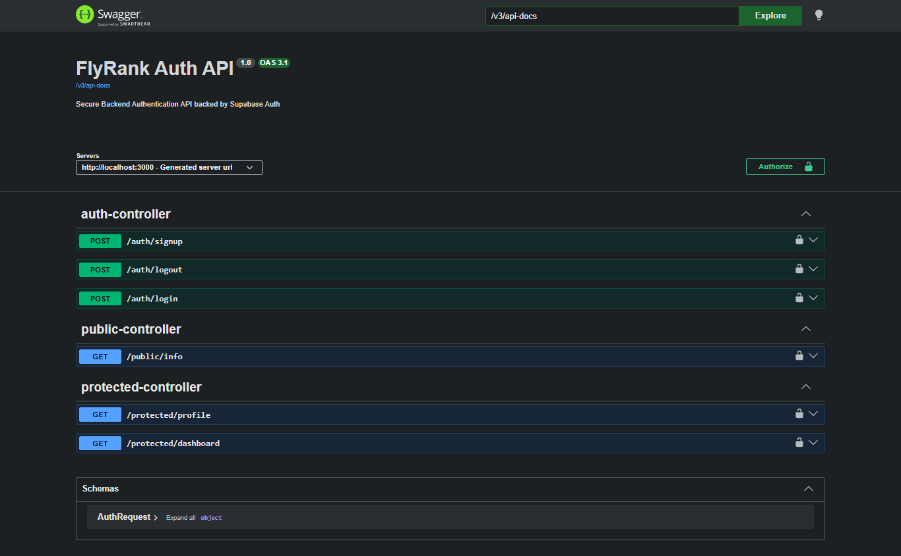

# 🔐 Auth Service - Login & Protect API

A secure REST API built with **Java**, **Spring Boot**, and **Supabase Authentication**.

This project demonstrates modern backend authentication using **Supabase Auth** as the Identity Provider (IdP). It supports user registration, login, JWT authentication, protected routes, logout, and Swagger UI documentation.

---

## 📌 Assignment Information

| Field | Value |
|-------|-------|
| Assignment | BE-03 |
| Title | Auth - Login & Protect |
| Track | Backend AI Engineering |
| Week | Week 4 |
| Workload | 6 Hours |

---

# ✨ Features

- ✅ User Registration (Sign Up)
- ✅ User Login
- ✅ JWT Authentication
- ✅ Protected API Endpoints
- ✅ Public API Endpoints
- ✅ Logout Endpoint
- ✅ Bearer Token Authentication
- ✅ Spring Security
- ✅ Supabase Authentication
- ✅ Swagger UI Documentation
- ✅ Environment Variable Support
- ✅ REST API Architecture

---

# 🛠️ Tech Stack

- Java 17
- Spring Boot 3
- Spring Security
- Maven
- REST API
- Supabase Auth
- JWT Authentication
- Swagger / OpenAPI
- Lombok
- Jackson

---

# 📂 Project Structure

```
src
├── controller
│   ├── AuthController
│   ├── PublicController
│   └── ProtectedController
│
├── service
│   └── SupabaseAuthService
│
├── security
│   └── JwtAuthenticationFilter
│
├── config
│   ├── SecurityConfig
│   └── SwaggerConfig
│
├── dto
│   ├── AuthRequest
│   └── ErrorResponse
│
└── resources
    └── application.properties
```

---

# 🔑 Environment Variables

Create a `.env` file (or configure environment variables):

```env
SUPABASE_URL=https://your-project.supabase.co
SUPABASE_KEY=your-anon-key
PORT=3000
```

---

# ⚙️ application.properties

```properties
server.port=${PORT:3000}

supabase.url=${SUPABASE_URL}
supabase.key=${SUPABASE_KEY}

springdoc.swagger-ui.path=/docs
```

---

# ▶️ Running the Project

### Clone Repository

```bash
git clone https://github.com/your-username/auth-service.git
```

### Go to Project

```bash
cd auth-service
```

### Run

```bash
./mvnw spring-boot:run
```

or

```bash
mvn spring-boot:run
```

---

# 📖 Swagger UI

Open:

```
http://localhost:3000/docs
```

Swagger allows testing all endpoints directly from the browser.

---

# 📮 API Endpoints

| Method | Endpoint | Description | Auth |
|---------|----------|------------|------|
| POST | /auth/signup | Register a new user | ❌ |
| POST | /auth/login | Login user | ❌ |
| POST | /auth/logout | Logout user | ✅ |
| GET | /public/info | Public endpoint | ❌ |
| GET | /protected/profile | User profile | ✅ |

---

# 📌 Request Examples

## Sign Up

**POST**

```
/auth/signup
```

```json
{
  "email": "test@example.com",
  "password": "Password123!"
}
```

---

## Login

**POST**

```
/auth/login
```

```json
{
  "email": "test@flyrank.com",
  "password": "Password123!"
}
```

---

## Protected Route

```
GET /protected/profile
```

Header

```
Authorization: Bearer YOUR_ACCESS_TOKEN
```

---

## Public Route

```
GET /public/info
```

No authentication required.

---

# ✅ HTTP Status Codes

| Code | Meaning |
|------|---------|
| 200 | OK |
| 201 | Created |
| 204 | No Content |
| 400 | Bad Request |
| 401 | Unauthorized |

---

# 🔐 Authentication Flow

```
Client
   │
   ▼
POST /auth/signup
   │
   ▼
Supabase Auth
   │
   ▼
POST /auth/login
   │
   ▼
JWT Access Token
   │
   ▼
Authorization: Bearer <token>
   │
   ▼
Protected APIs
```

---

# 🧪 Testing

### Public Endpoint

```
GET /public/info
```

Expected Response

```json
{
  "message": "Welcome stranger! This info is public."
}
```

---

### Protected Endpoint

```
GET /protected/profile
```

Header

```
Authorization: Bearer YOUR_ACCESS_TOKEN
```

---

# 📷 Swagger Screenshot




---

# 🚀 Future Improvements

- Refresh Token Rotation
- Role Based Authorization
- Admin Dashboard
- Unit Tests
- Docker Support
- CI/CD Pipeline

---

# 📚 Learning Outcomes

This project demonstrates:

- REST API Development
- Spring Security
- JWT Authentication
- Supabase Authentication
- Protected Routes
- Environment Variables
- Swagger Documentation
- Clean Project Structure
- Backend Security Best Practices

---

# 📄 License

This project was developed for the **Backend AI Engineering Internship (BE-03 Assignment)** and is intended for learning purposes.