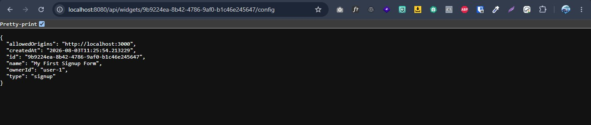
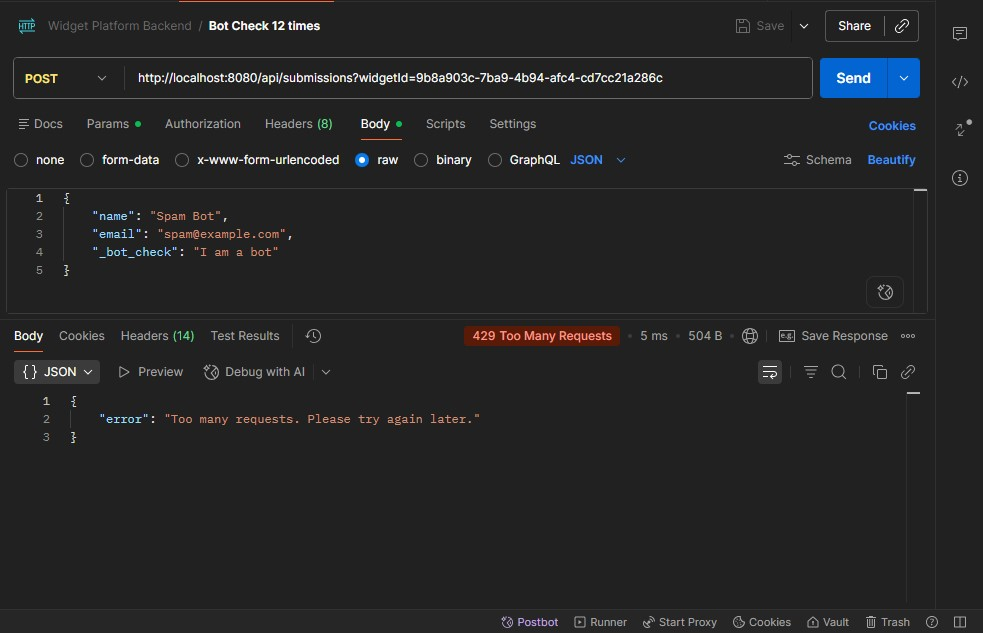

# Capstone Evidence

## 1. Widget Management
**Proof of Authenticated CRUD / Multi-tenant isolation:**
```
{
"allowedOrigins": "http://localhost:3000",
"createdAt": "2026-08-03T11:25:54.2132286",
"id": "9b9224ea-8b42-4786-9af0-b1c46e245647",
"name": "My First Signup Form",
"ownerId": "user-1",
"type": "signup"
}
```

## 2. Widget Delivery
**Proof of Versioned Bundle / Config:**


---
## 3. Public Submission API
**Proof of Cross-origin submission & Validation:**
```
[INFO] Running com.rifat.widget_platform_backend.controller.SubmissionControllerTest
[INFO] Tests run: 4, Failures: 0, Errors: 0, Skipped: 0, Time elapsed: 10.523 s
[INFO] 
[INFO] BUILD SUCCESS
[INFO] ------------------------------------------------------------------------
Process finished with exit code 0
```

## 4. Abuse Protection
**Proof of Rate Limiting (429) & Honeypot:**


## 5. Enrichment & Safe Side Effects
**Proof of IP Geo enrichment & Safe Email side effect:**
````
2026-08-03T11:37:53.495+06:00  INFO 16788 --- [widget-platform-backend] [nio-8080-exec-1] c.r.w.service.NotificationService        : Attempting to send notification email for widget: My First Signup Form
2026-08-03T11:37:53.495+06:00  INFO 16788 --- [widget-platform-backend] [nio-8080-exec-1] c.r.w.service.NotificationService        : Successfully sent email notification to the widget owner.
````

```
2026-08-03T11:35:44.588+06:00  INFO 10000 --- [widget-platform-backend] [io-8080-exec-10] c.r.w.service.NotificationService        : Attempting to send notification email for widget: My second Signup Form
2026-08-03T11:35:44.589+06:00 ERROR 10000 --- [widget-platform-backend] [io-8080-exec-10] c.r.w.service.NotificationService        : Safe Side Effect Triggered: Failed to send email - Email server connection timed out or blocked!. But submission will be saved safely!
```